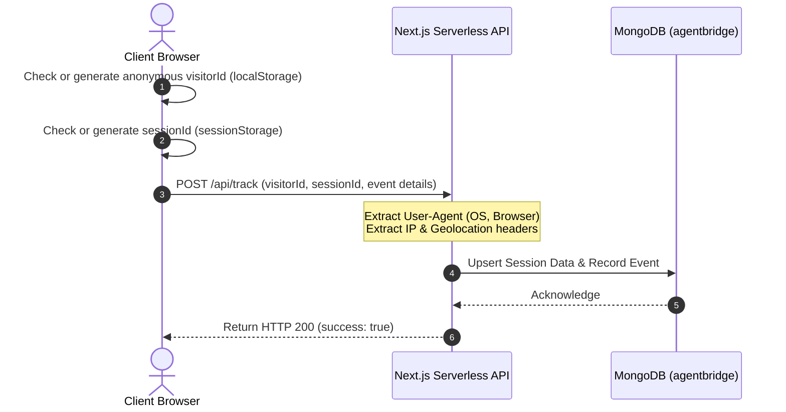

# Anonymous User Tracking System Structure

This document outlines the architecture, data structures, and database schemas for tracking website users and their interactions **without requiring user registration or login**.

---

## 🏗️ System Architecture



---

## 📁 1. Client-Side Data Collection

To track users anonymously across visits and sessions, we generate and store two distinct identifiers in the browser:

1. **`visitorId` (Persistent Identifier):**
   - **Storage:** `localStorage`
   - **Lifetime:** Permanent (until cleared by user)
   - **Purpose:** Identifies the same physical browser/device across multiple visits.
   
2. **`sessionId` (Session-bound Identifier):**
   - **Storage:** `sessionStorage` or standard short-lived session cookie
   - **Lifetime:** Cleared when the browser tab or window is closed.
   - **Purpose:** Groups related pageviews and actions into a single continuous browsing session.

### Automatically Collected Client Metadata:
* Current page URL (`window.location.pathname`)
* Referrer URL (`document.referrer`)
* Screen resolution and window dimensions
* System language settings
* UTM parameters (`utm_source`, `utm_medium`, `utm_campaign`, etc.)

---

## 🔌 2. Server-Side Edge Information

When tracking requests reach the server, additional data can be extracted automatically from headers (particularly useful on platforms like Vercel):

* **User-Agent:** Parsed on the server to determine the Operating System (e.g., Windows, macOS, Android), Browser (e.g., Chrome, Safari, Firefox), and Device Type (Desktop, Mobile, Tablet).
* **IP Address:** Can be hashed to create an anonymized hash for security, preventing raw PII storage while still allowing rate limiting and unique visitor counts.
* **Geolocation (Vercel Edge Headers):**
  * `x-vercel-ip-country` (e.g., "US", "IN")
  * `x-vercel-ip-country-region` (e.g., "CA", "MH")
  * `x-vercel-ip-city` (e.g., "San Francisco", "Mumbai")

---

## 🗄️ 3. Database Schema Design (MongoDB)

We structure the tracking into two separate collections: `sessions` (representing the session-level metadata) and `events` (representing granular actions like pageviews, downloads, or clicks).

### Collection A: `visitor_sessions`
Stores session metadata, geo-location, and device details.

* **Indexes:**
  * `{ "visitorId": 1 }`
  * `{ "sessionId": 1 }` (Unique)
  * `{ "createdAt": -1 }` (For chronological analytics)

#### Schema Document Example:
```json
{
  "_id": "ObjectId",
  "visitorId": "v_8f9c2d1b-e5a6-4b92-801c-724efd3a90ab",
  "sessionId": "s_1a2b3c4d-5e6f-7a8b-9c0d-e1f2a3b4c5d6",
  "device": {
    "os": "Windows 11",
    "browser": "Chrome 125",
    "deviceType": "desktop",
    "screenResolution": "1920x1080"
  },
  "location": {
    "country": "India",
    "region": "Maharashtra",
    "city": "Mumbai"
  },
  "trafficSource": {
    "referrer": "https://github.com/",
    "utmSource": "github",
    "utmMedium": "readme",
    "utmCampaign": "open_source_promo"
  },
  "createdAt": "2026-06-14T11:00:00Z",
  "lastActivityAt": "2026-06-14T11:05:30Z"
}
```

---

### Collection B: `visitor_events`
Stores individual interactions (page views, button clicks, download triggers).

* **Indexes:**
  * `{ "visitorId": 1 }`
  * `{ "sessionId": 1 }`
  * `{ "timestamp": -1 }`

#### Schema Document Example:
```json
{
  "_id": "ObjectId",
  "visitorId": "v_8f9c2d1b-e5a6-4b92-801c-724efd3a90ab",
  "sessionId": "s_1a2b3c4d-5e6f-7a8b-9c0d-e1f2a3b4c5d6",
  "eventType": "page_view", // "page_view" | "button_click" | "download"
  "eventPath": "/download",
  "details": {
    "elementId": "download-btn-windows",
    "fileName": "agentbridge-windows-1.0.0.exe",
    "timeSpentOnPreviousPageMs": 15000
  },
  "timestamp": "2026-06-14T11:05:30Z"
}
```

---

## 🛡️ 4. Privacy & Compliance Considerations

Since this system tracks details without user login, we design it with privacy-by-default to align with GDPR, CCPA, and ePrivacy regulations:

1. **No Personal Identifiable Information (PII):** Do not store raw IP addresses, precise GPS coordinates, or any form of email/username in the tracking collections.
2. **Opt-out Mechanism:** Provide support for a DNT (Do Not Track) header or a cookie-consent preference that disables client-side storage and event sending entirely.
3. **Anonymized IP Hashing (Optional):** If IP-based rate limiting is required, hash the IP server-side with a daily rotating salt before saving, ensuring it cannot be reverse-engineered back to the original IP address.
